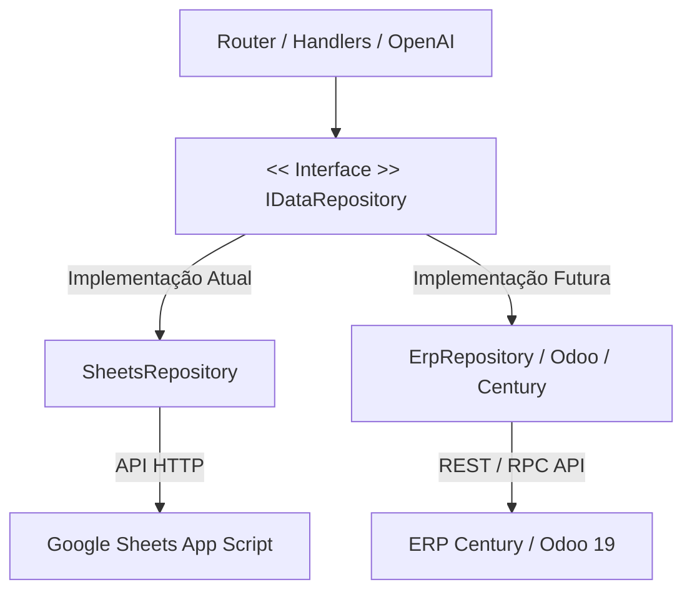

# Checklist de Integração ERP — Transição Futura (Century / Odoo 19)

Este documento estabelece o **Contrato de Interfaces** e o checklist técnico conceitual para a futura substituição da base de dados do Google Sheets pelos ERPs **Century** ou **Odoo 19**, preservando o cérebro da assistente virtual Samantha (OpenAI) e a lógica de canais (WhatsApp Web).

---

## 1. Abstração de Arquitetura (Padrão Repository)

Para evitar que o código de negócio do bot fique acoplado a uma tecnologia específica de banco de dados (Google Sheets), implementaremos a transição isolando toda a infraestrutura em repositórios que implementam a mesma interface comum.



### O Contrato de Interface Esperado (`IDataRepository`)

Qualquer repositório futuro de dados (como o `ErpRepository`) deve expor os seguintes métodos assíncronos:

```javascript
// Interface abstrata esperada no código
class IDataRepository {
  async getSystemInfo() {}
  async getProducts(query, category) {}
  async getFAQs(query) {}
  async getBranches(query) {}
  async getServices(query) {}
  async appendLead(leadData) {}
  async appendHistory(historyData) {}
  async fetchBotControlStatus(phone) {}
  async updateBotStatus(phone, status) {}
}
```

Dessa forma, quando a empresa decidir mudar para o Odoo ou Century, **não precisaremos alterar nenhuma linha de código em `src/index.js` ou `src/handlers/`**. Bastará criar o arquivo `src/repositories/erp.js` e alterar a importação principal para utilizá-lo.

---

## 2. Mapeamento Conceitual de Dados

Abaixo está o dicionário de campos que estabelece a tradução entre as tabelas do Sheets e as entidades equivalentes em um ERP tradicional:

### A. Catálogo de Produtos
* **Sheets (`productos`):** `sku`, `nombre`, `presentacion`, `precio_pyg`, `precio_brl`, `requiere_receta`, `categoria`, `disponible`.
* **Century / Odoo 19:** Entidade `product.template` ou `product.product`.
  * `sku` → `default_code` (Código de referência interno).
  * `precio_pyg` e `precio_brl` → Listas de preços (`product.pricelist`) associadas às moedas PYG e BRL.
  * `requiere_receta` → Campo booleano customizado no ERP (`x_requiere_receta`).
  * `disponible` → Quantidade disponível em estoque (`qty_available` ou quantidade projetada `virtual_available` > 0).

### B. Registro de Leads (Interesses de Compra)
* **Sheets (`leads`):** `telefone`, `nome`, `produto_servico`, `data_hora`, `idioma`, `notas`.
* **Odoo 19 (CRM):** Entidade `crm.lead` (Oportunidades de venda).
  * `nome` + `produto_servico` → Título da oportunidade (`name`, ex: "Interesse: Tirzepatida - João").
  * `telefone` → Campo de telefone/celular do contato (`phone` ou `mobile`).
  * `notas` (com número do protocolo) → Descrição interna da oportunidade (`description`).
  * Odoo criará automaticamente o parceiro de negócios correspondente (`res.partner`) se o telefone não existir na base de contatos.

### C. Histórico de Atendimentos
* **Sheets (`historico`):** `telefone`, `data_inicio`, `data_fim`, `idioma`, `topicos`, `desfecho`, `turnos`.
* **Odoo 19:** Modelo de atividades ou mensagens internas (`mail.message` / `mail.activity`) anexado ao registro do contato (`res.partner`), servindo como uma timeline de atendimento do CRM.

---

## 3. Checklist Técnico para Execução

Quando a integração do ERP for iniciada na v2:
- [ ] **Configurar Credenciais:** Adicionar no `.env` chaves como `ERP_URL`, `ERP_DB`, `ERP_USERNAME` e `ERP_PASSWORD` (para XML-RPC do Odoo) ou tokens de API JWT (para Century ERP).
- [ ] **Escrever o Repositório do ERP:** Desenvolver `src/repositories/erp.js` conectando com as APIs correspondentes.
- [ ] **Tratar Indisponibilidade de API:** Implementar circuit breaker no `ErpRepository` para que o bot avise o cliente amigavelmente ou use cache local caso a API do ERP caia temporariamente.
- [ ] **Validar Mapeamento de SKUs:** Garantir que o bot Samantha consiga consultar produtos no catálogo do ERP mesmo se os atendentes digitarem nomes parciais (utilizando busca fuzzy via código).
